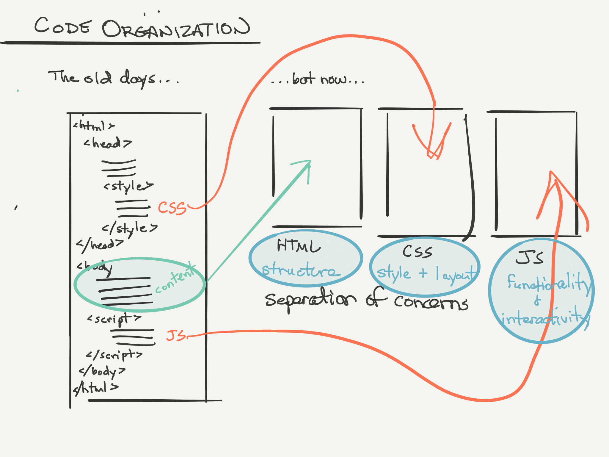
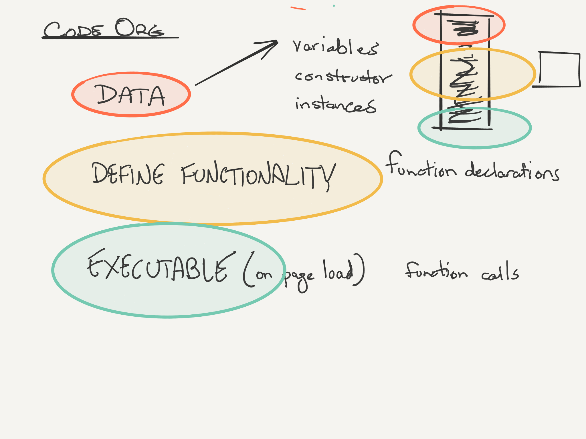

# Class 7: Object-Oriented Programming with Constructor Functions; HTML Tables

## Daily 'Motivation' video 
<a href= "https://www.youtube.com/watch?v=26U_seo0a1g&list=PLudyweVVEYPCV5YhRkUZgFAJwLZWWMTNo&index=18&t=0s">Your Daily Motivational video</a>

### Overview

This is the first of the two toughest days in the course. Introducing inheritance with constructor functions, plus adding another dimension to dynamic DOM rendering by creating a table instead of lists from stored array data, is often a bigger bite than most students can completely chew on one day, especially if there were any issues lingering from Class 6.

A lengthy code review session at the beginning of class is the best way to try to get everyone as close to the same place as possible. Make sure students know that it is OK to be feeling challenged at this point, and that this is much tougher material than anything they’ve yet seen.

At the same time, the instructor(s) should be getting more solid on which students they think are not going to make it, and making preparations for the necessary conversations. Continue to stress to the class that the key to being successful is to write code that is modularized as much as possible, and to check it frequently in the console, and of course follow that up with a Git commit.

### Class 7 Lecture: Object-Oriented Programming with Constructor Functions; HTML Tables
* Code Review
  * Depending on how the students worked during the previous lab, decide if it is a better use of time to code the solution from scratch or to go through one student's solution as a class
* HTML/CSS book, Ch. 6, “Tables”  
	* p.131: Basic table structure  
	* p.132: Table headings  
	* p.133: Spanning columns & rows  
* JavaScript book, Ch. 3, "Functions, Object, and Methods"
  * p.108-111: Create & Access Objects, Constructor Notation
    * Object names begin with a capital letter
    * Think of a constructor as a template and has parameters, which set the value of a property in an object
    * All object will receive all of these properties and methods
    * Point out the ability to use a constructor function when making many of the same type of object
    * Point out that `this` is used to indicate that the property/method belongs to the object that `this` function creates. It can help to refer to `contextual this` to distinguish it from the English word "this".
    * Instantiate with the `new` keyword
* Code Demo
  * Compare the amount of code needed to write an object literal and a constructor function. On the surface, constructors don't appear to save much time, but point out that it takes a single line to create a new instance of an object with a constructor, whereas an object literal required the same lines of code to be written out each time.
    * For example: if it takes 10 lines to make each student into an object literal, and there are 25 students in the class, that is 250 lines of code
    * However, with a 10-line constructor, the same can be accomplished in 35 lines of code
  * Take time to explain the nested nature of creating a table in JavaScript. For example, each table has children, each of which is `<tr>`, and each `<tr>` then has its own children, each of which is `<th>` or `<td>`. Run through a basic demonstration of how to append `<td>`/`<th>` elements to a `<tr>` element, then append the `<tr>` element to a `<table>` element. This will provide some basic context for the lab setup.

[-top-](#top)

### Class 7 Lab: Add a Constructor Function to the Cookie Stand Project

For today's lab, students will be refactoring all of their object literals for the cookie stores into a single constructor function with multiple instances. The second component of today's lab is to convert their list elements from the previous lab's work into a table that is dynamically rendered to the DOM from their JavaScript file.

All of the methods for the constructor function should be inherited using its `.prototype` property.

Encourage students to approach today's lab one step and a time and outline what they plan to do prior to writing the code. Also encourage students to write out the functionality the long way first to make it work, then refactor into for loops, functions, etc.

Some common pitfalls for today's lab include appending children to parents in the incorrect order, misuse of `this`, and figuring out how to access the data in each individual object. Prepare for a more detailed code review in the next class.

[-top-](#top)

## Whiteboard Diagrams

### Code Organization

---
### Code Organization 2

---

[-top-](#top)